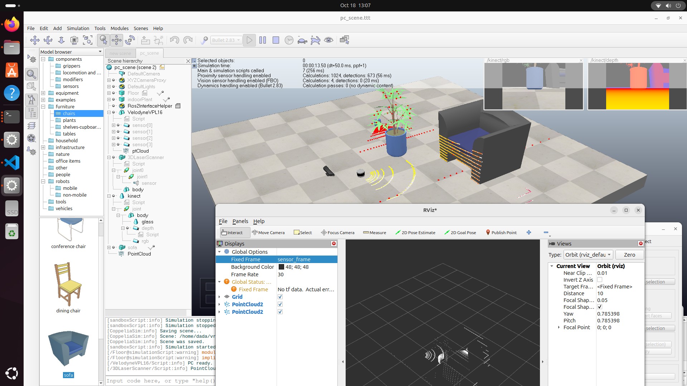

# coppeliasim-pointcloud-ros2
ROS2 interface for sensors in coppeliasim to get pointcloud



## install

Assume you have your ROS2 settled on your system.

1.  Install necessary libs.
    ```
    sudo apt install xslproc
    sudo apt install python3-pip
    pip3 install xmlschema --break-system-packages
    ```

2.  Create ros2_ws.
    ```
    mkdir -p ros2_ws/src
    cd ros2_ws/src
    git clone https://github.com/CoppeliaRobotics/simROS2.git sim_ros2_interface
    cd sim_ros2_interface
    git checkout coppeliasim-v4.7.0-rev0
    ```

    NOTE: replace coppeliasim-v4.5.0-rev0 with the actual CoppeliaSim version you have.


3.  Edit meta/interfaces.txt if you need to include more ROS interfaces. You need to specify the fully qualified interface, e.g. geometry_msgs/msg/Twist rather than Twist. If an interface uses non-primitive types (i.e. other interfaces), then those should be added as well.

    You can replace the interface.txt in this repo to the original interface.txt.

4. Add coppeliasim path.
    ```
    export COPPELIASIM_ROOT_DIR=~/path/to/coppeliaSim/folder
    ```

5. Compile.
    ```
    ulimit -s unlimited
    colcon build --symlink-install --cmake-args -DCMAKE_BUILD_TYPE=Release
    ```

## usage

1.  Open the pc_scene.ttt scene in coppeliasim. > Start simulation.

2.  Open another terminal to see ros2 topic or open rviz2 to visualize the point cloud.